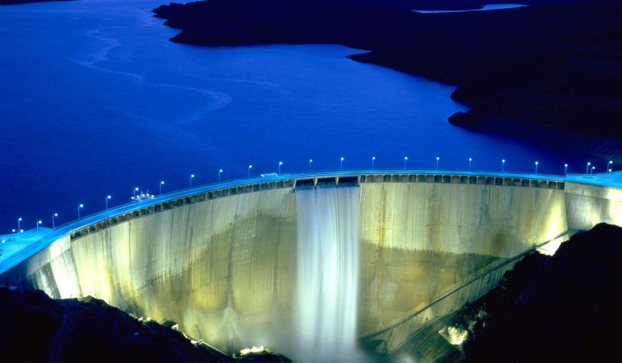

```{r setup, include=FALSE}
knitr::opts_chunk$set(echo = TRUE)
```
## Descripción

El conjunto de datos generado como parte de esta actividad práctica reúne las características de capacidad y estado de los embalses españoles lo más actualizado posible. Algunas de las variables que se recogen en el conjunto de datos son la capacidad, cuenca, nivel actual y variación respecto a la semana anterior.

## Contexto

Como se ha comentado, la materia del conjunto de datos se corresponde con  los datos de ciertos embalses españoles. Se incluye información de las cuencas del Duero, Ebro, Guadalquivir, Guadiana y Tajo, para poder llevar acabo un estudio semanal de la evolución de las principales cuencas de España. Los datos serán actualizados una vez a la semana, seran recogidos los lunes y se verán reflejados los martes.

## Contenido

Para cada embalse, el cual se corresponde con un registro en el conjunto de datos, se recogen las siguientes características:
  
* **Nombre**: nombre del embalse, con el que vamos a identificarlo.
* **Cuenca**: cuenca a la que pertenece el embalse.  
* **Actual**: unidades que dispone en el momento de la actualización el embalse, medido en hectómetros cúbicos.  
* **Capacidad**: unidades que puede almacenar el embalse, medido en hectómetros cúbicos.  
* **Variación**: unidades que ha variado el embalse, respecto a la semana anterior, medido en hectómetros cúbicos.  
  

Los autores de la web *Embalses* recopilando la información facilitada por el *Ministerio de Medio Ambiente*. 

\newpage
## Imagen identificativa




## Agradecimientos

Los datos han sido recolectados desde las diferentes webs [Embalses.net](http://www.embalses.net). Para ello, se ha hecho uso del lenguaje de programación Python y de técnicas de *Web Scraping* para extraer la información alojada en las páginas HTML.

## Inspiracion

Este conjunto de datos podrá utilizarse para diferentes fines. El primero de ellos, podría ser el ámbito informativo, como podria ser periodístico.

Pero sin ninguna duda, su principal utilidad podría ser en el campo de la *minería de datos*, a la hora de elaborar modelos predictivos. Debido a la necesidad de agua y a los problema de sequia que se vienen sufriendo, se puede intentar predecir las reservas  de las que se puede disponer.

## Licencia

La licencia escogida para la publicación de este conjunto de datos ha sido **CC0: Public Domain License**. Se ha seleccionado esta licencia por el siguiente motivo:

* *Se trata de una información que facilita el *Ministerio de Medio Ambiente*, por lo que son datos públicos y que son accesibles por cualquier persona, lo único que se hace es agruparlos y facilitarlos de una forma más comoda y rápida.

* *Se permite un uso comercial*. Ya que como se renuncia a cualquier derecho de autor por parte del Ministerio, ya que como se comenta en anterior se publica de forma regular por el mismo.

## Código fuente y dataset

Tanto el código fuente escrito para la extracción de datos como el dataset generado pueden ser accedidos a través de [este enlace](https://github.com/Sgarciafe1985/Practica1).

## Recursos

1. Lawson, R. (2015). Web Scraping with Python. Packt Publishing Ltd. Chapter 2. Scraping the Data  
2. Mitchel, R. (2015). Web Scraping with Python: Collecting Data from the Modern Web. O'Reilly Media, Inc. Chapter 1. Your First Web Scraper.
3. Masip, D. (2010). El lenguaje Python. Editorial UOC
4. Simon Munzert, Christian Rubba, Peter Meißner, Dominic Nyhuis. (2015). Automated Data Collection with R: A Practical Guide to Web Scraping and Text Mining. John Wiley & Sons.